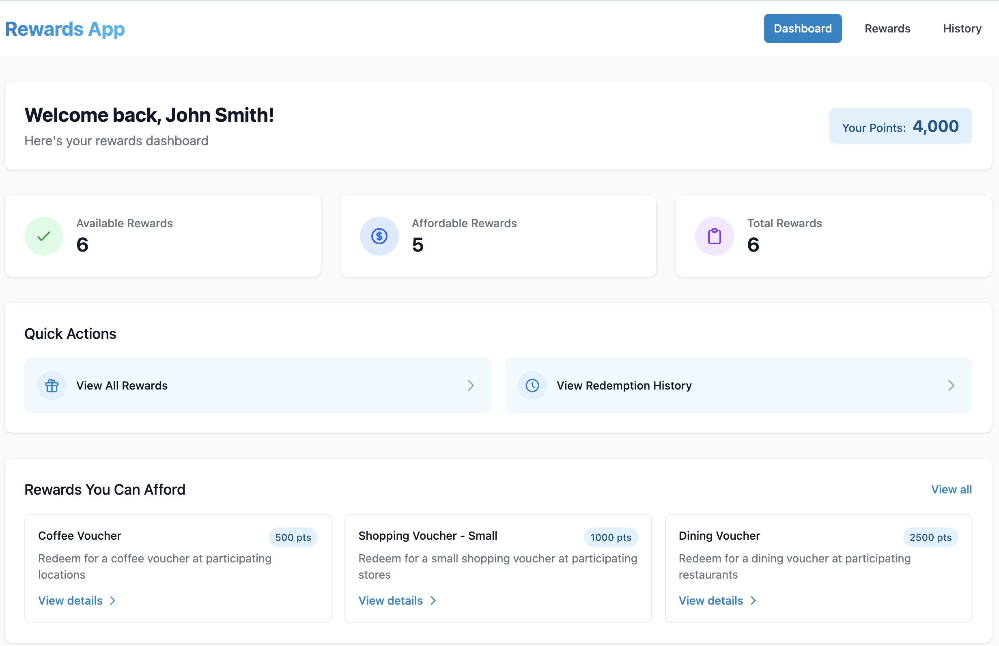
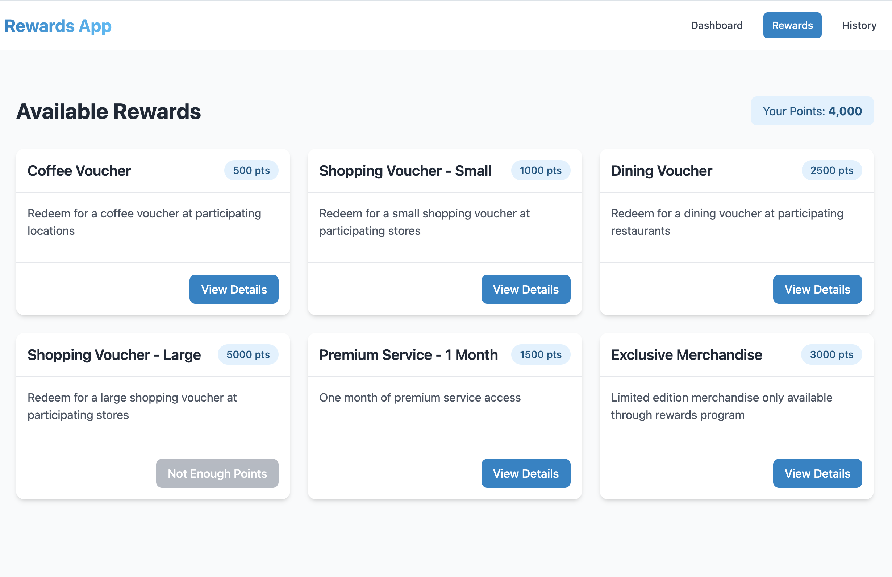
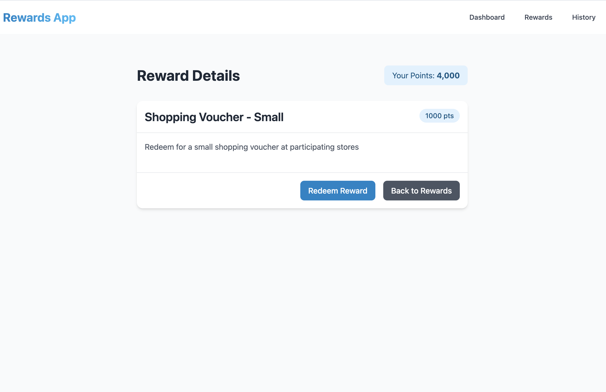
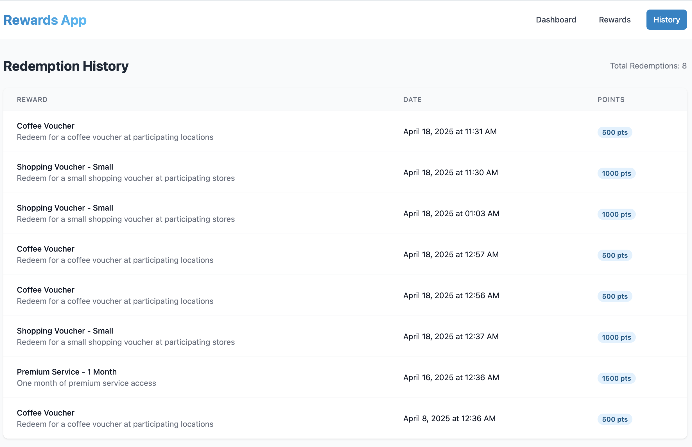

# Rewards Redemption App

A modern web application for managing and redeeming rewards points. Built with Ruby on Rails backend and React frontend.

## Features

- Points management system
- Reward catalog with detailed information
- Reward redemption functionality
- Redemption history tracking
- Modern UI with Tailwind CSS and CSS Modules
- Responsive design for all devices

## Technology Stack

### Backend
- Ruby on Rails 8.0.2
- SQLite database
- RESTful API
- RSpec, Factory Bot, Shoulda Matchers for testing

### Frontend
- React 18
- React Router v6
- Tailwind CSS
- CSS Modules
- Axios for API calls

## Prerequisites

- Ruby 3.4.3
- Node.js 18 or higher
- Bundler
- npm or yarn

## Setup

### Backend Setup

1. Install Ruby dependencies:
   ```bash
   bundle install
   ```

2. Set up the database:
   ```bash
   rails db:setup
   ```

3. Start the Rails server:
   ```bash
   rails server -p 3000
   ```

### Frontend Setup

1. Navigate to the client directory:
   ```bash
   cd client
   ```

2. Install JavaScript dependencies:
   ```bash
   npm install
   ```

3. Start the development server:
   ```bash
   npm start
   ```
   This will start the frontend on port 3001 and proxy API requests to the Rails server on port 3000.

## API Endpoints

### Users
- `GET /api/v1/users/:id` - Get user profile with points balance

### Rewards
- `GET /api/v1/rewards` - Get list of available rewards
- `GET /api/v1/rewards/:id` - Get details for a specific reward

### Redemptions
- `GET /api/v1/users/:user_id/redemptions` - Get user's redemption history
- `POST /api/v1/users/:user_id/redemptions` - Redeem a reward (requires reward_id in params)

## User Interface

- **Dashboard**: Shows points balance, recent rewards, and recent redemptions
- **Rewards List**: Displays all available rewards with modern card-based layout
- **Reward Detail**: Shows detailed information about a reward and allows redemption
- **Redemption History**: Shows all past redemptions in a clean table format

## Development Notes

- Points deduction happens in the controller when redeeming a reward
- Rewards can be marked as unavailable
- API responses are formatted using Jbuilder templates
- The project uses RSpec for testing with Factory Bot for test data
- Frontend styling is implemented using Tailwind CSS and CSS Modules for component-specific styles

## Screenshots

### Dashboard


### Rewards List


### Reward Detail


### Redemption History
